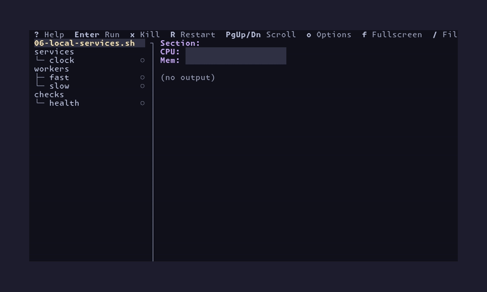
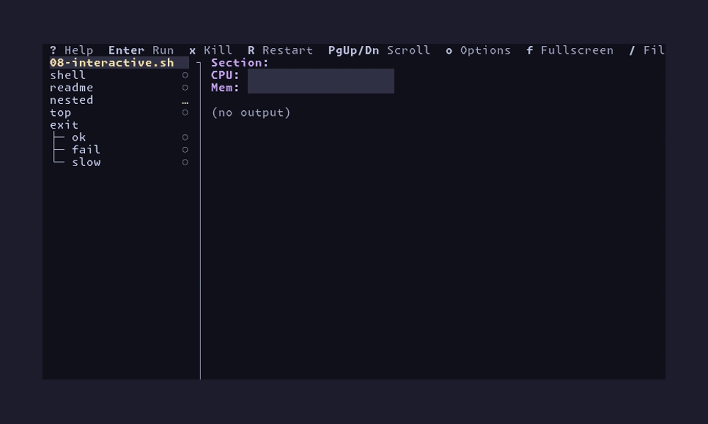

A TUI application for managing multiple processes locally. Useful for testing
multi-process applications where you need to run several services
simultaneously and monitor their output.



## Installation

1. If you are new to OCaml - or if you haven't already - **install
   [opam](https://opam.ocaml.org/)**. It is OCaml's package manager
   and we'll be using it to install `proctopus` and its dependencies.
   The specific installation instructions depend on your platform. You
   can find platform-specific instructions
   [here](https://opam.ocaml.org/doc/Install.html).
2. `proctopus` uses [OxCaml](https://oxcaml.org/) so the next thing
   you'll want to do is install `oxcaml` by following the instructions
   [here](https://oxcaml.org/get-oxcaml/).
3. Run `opam install proctopus`. This will install the `proctopus`
   binary onto your `PATH`, along with its dependencies.

## Usage

```bash
proctopus \
  'services/api:./start-api.sh' \
  'services/web:./start-web.sh' \
  -n 'tests/unit:pytest tests/' \
  -n 'tests/integration:pytest integration/'
```

Will produce a UI that looks like something like this:

```
┌──────────────────────────────────────────────────────────────────────────────────────┐
│ Enter Run  x Kill  PgUp/Dn Scroll Output  g/G Output Top/Bottom  w Toggle Wrap       │
│                                                                                      │
│ services         │ Command: ./start-api.sh                                           │
│ ├─ api         ● │ Status: running (PID 12345)                                       │
│ └─ web         ● │                                                                   │
│ tests            │ Output:                                                           │
│ ├─ unit        ○ │ Starting server on port 8080...                                   │
│ └─ integration ○ │ Connected to database                                             │
│                  │ Ready to accept connections                                       │
│                  │                                                                   │
└──────────────────────────────────────────────────────────────────────────────────────┘
```

Positional arguments are commands that run automatically on startup. Commands passed with
`-n` won't run automatically (but you can start them manually). You can use this to
differentiate between "apps" and "jobs."

Due to limitations of the `Command` parsing library, commands specified with `-n` will
appear after positional arguments, regardless of the order you pass them.

## Using bash functions to express complex commands

If you have a shell script that invokes `proctopus`, you can specify more complex commands
as shell functions that you export with `export -f`. For example:

```bash
#!/usr/bin/env bash

set -eou pipefail

function start-server () {
  cd /path/to/server
  ./configure && make && ./run
}

function start-worker () {
  cd /path/to/worker
  ./worker --connect localhost:8080
}

export -f start-server
export -f start-worker

exec proctopus \
  'server:start-server' \
  'worker:start-worker' \
  -n 'status:curl localhost:8080/health'
```

(Note that if your shell functions reference any variables, you have to export those as
well.)

You can find working examples in the `example` directory.

You can pass `-i name:command`, to make proctopus run your command
"interactively", letting you embed other TUI inside of proctopus. You can take a
look at `example/08-interactive.sh` for some examples.


